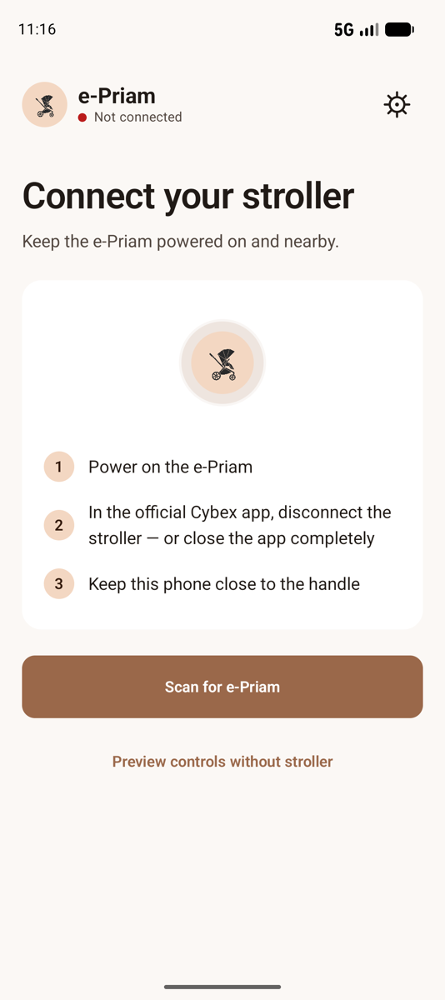
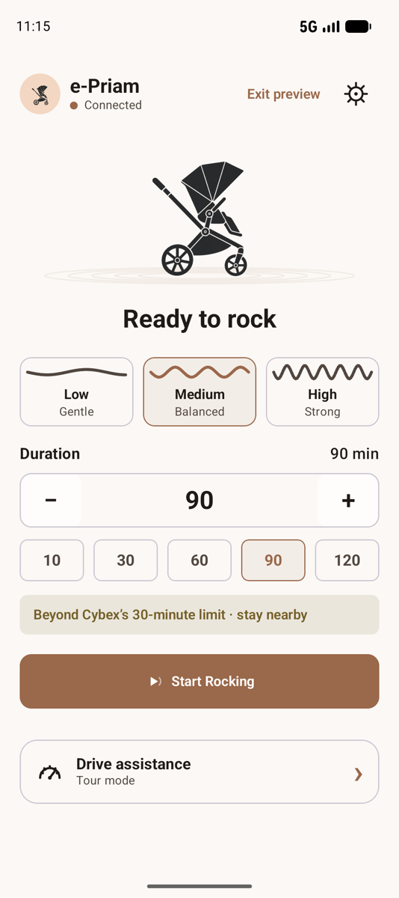
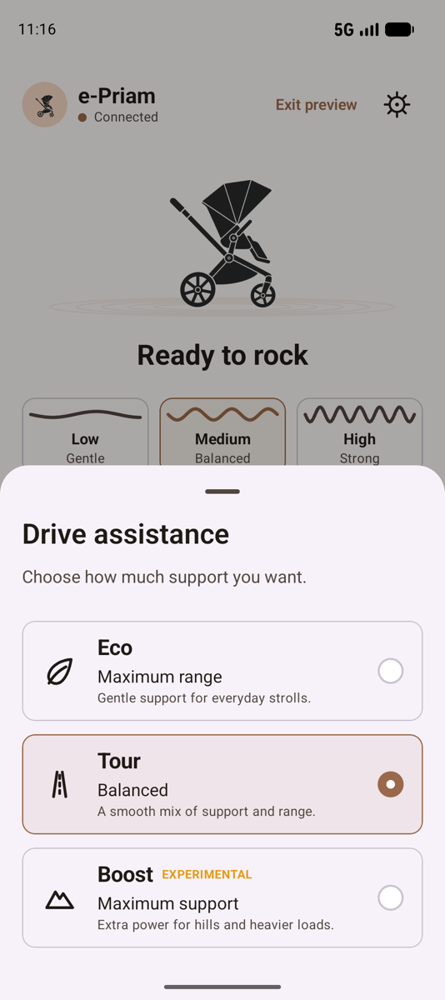

# ePriam Connect

An unofficial, open-source Android controller for the CYBEX e-Priam stroller.

<p align="center">
  
  
  
</p>

## Features

- Direct Bluetooth LE discovery and connection
- Rocking intensity and timers up to three hours
- Eco, Tour, and experimental Boost drive assistance
- Battery status, light/dark themes, and offline demo mode

## Build

Requires JDK 17 and Android SDK 36.

```bash
./gradlew assembleDebug
```

The APK is generated at `app/build/outputs/apk/debug/app-debug.apk`.

## Disclaimer and safety

This is an independent enthusiast project provided **as is**, without any warranty or guarantee of safety, reliability, or fitness for a particular purpose. By using this software, you accept full responsibility and assume all risk for its use, including personal injury, property damage, and damage to the stroller or connected devices. To the maximum extent permitted by applicable law, the author and contributors accept no liability for any loss, damage, injury, or other consequence arising from its use or misuse.

Test only with an empty stroller, stay nearby, and physically verify that motion has stopped after any connection or command failure. Boost and sessions longer than 30 minutes are not exposed by the official app and may carry additional risk.

This project is not affiliated with or endorsed by CYBEX GmbH.

## Documentation

- [Protocol research](docs/protocol-research.md)
- [Hardware validation](docs/hardware-validation.md)
- [Implementation plan](docs/android-implementation-plan.md)

## Credits

The Bluetooth protocol research in this project was informed by:

- [python-priam](https://github.com/vincegio/python-priam) by [@vincegio](https://github.com/vincegio) — the original Python proof of concept for controlling the e-Priam over Bluetooth.
- [esPriam32](https://github.com/owanvik/esPriam32) by [@owanvik](https://github.com/owanvik) — an ESP32 implementation covering BLE connection, rocking, drive modes, and battery monitoring.

Thank you to both maintainers for publishing their work.

## License

[MIT](LICENSE)
